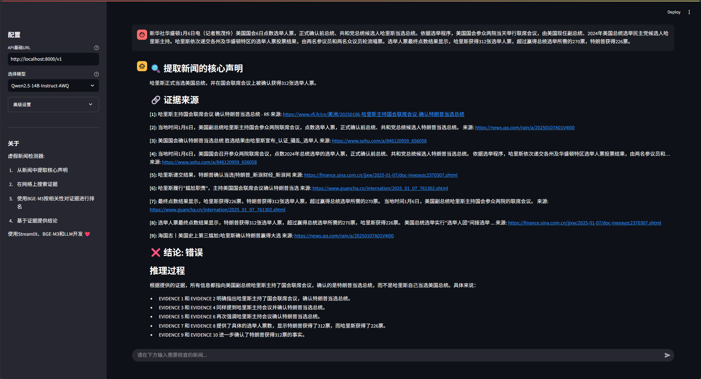

# 🔍 AI Fake News Detector

An intelligent news verification system based on fact-checking, using semantic embedding technology and large language models for accurate, evidence-backed fact-checking.

[](https://python.org)
[](https://streamlit.io)
[](LICENSE)



> ⚠️ **Student Project Notice**: This is a student project demo using free-tier AI models. Please verify important claims through official fact-checking sources.

## ✨ Core Features

### 🌍 Multilingual Input, English Output
- **Intelligent Language Detection**: Automatically recognizes input in multiple languages
- **Consistent English Output**: Regardless of the input language, claims, verdicts, and reasoning are always returned in English

### 🤖 Cloud-Based AI Stack
- **LLM (chat/reasoning)**: [Groq](https://console.groq.com) — fast, free-tier inference
- **Embeddings**: [Google Gemini](https://aistudio.google.com) (`gemini-embedding-001`) — free-tier semantic embeddings
- No local model server or GPU required — everything runs on free cloud APIs

### 🔍 High-Precision Fact-Checking
- **Claim Extraction**: Intelligently extracts core verifiable claims from news text
- **Web Evidence Search**: Uses DuckDuckGo (via `ddgs`) to retrieve relevant evidence
- **Semantic Matching**: Uses Gemini embeddings to rank evidence by relevance
- **Transparent Reasoning**: Provides a detailed reasoning process and evidence sources

### 📊 Complete Data Management
- **History**: Save and view all fact-checking history
- **PDF Export**: Generate professional fact-check reports
- **User System**: Supports independent use by multiple users, with secure salted password hashing

## 🚀 Quick Start

### Prerequisites

- **Python 3.12+**
- A **Groq API key** (free — [console.groq.com](https://console.groq.com))
- A **Google Gemini API key** (free — [aistudio.google.com](https://aistudio.google.com))

### Installation Steps

1. **Clone the repository**
```bash
git clone https://github.com/Abhizz-b/fake_news_detector.git
cd fake_news_detector/backend
```

2. **Install dependencies**
```bash
pip install -r requirements.txt
```

3. **Configure your API keys**

Create a `.env` file in the project root:
```
GROQ_API_KEY=your_groq_api_key_here
GEMINI_API_KEY=your_gemini_api_key_here
```

### Launch the Application

**Windows (one-click):**
```bash
start_app.bat
```

**Manual:**
```bash
streamlit run app.py
```

The application will start at http://localhost:8501

## 📋 Project Structure

```
fake_news_detector/backend/
├── app.py                 # Main Streamlit application
├── fact_checker.py        # Core fact-checking logic
├── model_manager.py       # Model management and configuration
├── model_config.json      # Model and service configuration file
├── styles.py               # Custom UI styling
├── components.py           # Reusable UI components
├── database.py              # Database operations (users, history, evidence)
├── pdf_export.py           # PDF report generation
├── requirements.txt        # Project dependencies
├── start_app.bat            # One-click launcher (Windows)
├── docs/                   # Documentation and usage instructions
└── test/                   # Test files
```

## ⚙️ Configuration Guide

### Model Configuration (`model_config.json`)

The system is configured centrally through `model_config.json`:

```json
{
  "providers": {
    "groq": {
      "name": "Groq",
      "type": "openai_compatible",
      "base_url": "https://api.groq.com/openai/v1",
      "api_key": "${GROQ_API_KEY:-}",
      "models": {
        "llama-3.3-70b-versatile": {
          "name": "Llama 3.3 70B Versatile",
          "type": "chat",
          "max_tokens": 8192
        }
      }
    },
    "gemini": {
      "name": "Google Gemini",
      "type": "openai_compatible",
      "base_url": "https://generativelanguage.googleapis.com/v1beta/openai/",
      "api_key": "${GEMINI_API_KEY:-}",
      "models": {
        "gemini-embedding-001": {
          "name": "Gemini Embedding 001",
          "type": "embedding",
          "dimensions": 768
        }
      }
    }
  },
  "defaults": {
    "llm_provider": "groq",
    "llm_model": "llama-3.3-70b-versatile",
    "embedding_provider": "gemini",
    "embedding_model": "gemini-embedding-001",
    "output_language": "en"
  }
}
```

### Search Engine Configuration

Evidence search is powered by **DuckDuckGo** (via the `ddgs` package) — no additional setup or API key required.

## 🔄 Workflow

1. **Claim Extraction** — Uses Groq's LLM to extract the core claim from the input text
2. **Evidence Search** — Retrieves relevant web evidence via DuckDuckGo
3. **Semantic Ranking** — Uses Gemini embeddings to calculate evidence relevance
4. **Fact Judgment** — Makes a TRUE/FALSE/PARTIALLY TRUE/UNVERIFIABLE determination based on the evidence
5. **Result Presentation** — Provides a detailed reasoning process and evidence sources, always in English

## 📖 Usage Instructions

### Using the Web Interface

1. Sign up or log in
2. Enter the news content to be fact-checked
3. View real-time processing progress and the final verdict
4. Export a PDF report or view your fact-check history

For a full walkthrough, see [docs/usage.md](docs/usage.md)

## 🛠️ Development Guide

### Environment Setup

```bash
# Install the development environment
pip install -r requirements.txt

# Run tests
python -m pytest test/

# Start the development server
streamlit run app.py --server.runOnSave true
```

### Contributing Code

1. Fork this repository
2. Create a feature branch (`git checkout -b feature/amazing-feature`)
3. Commit your changes (`git commit -m 'Add amazing feature'`)
4. Push to the branch (`git push origin feature/amazing-feature`)
5. Create a Pull Request

## 📝 Changelog

### v2.0.0 (Latest)
- 🔧 Migrated to a fully cloud-based stack: Groq (LLM) + Google Gemini (embeddings)
- ☁️ Removed local model dependency (Ollama/LM Studio) for easier cloud deployment
- 🌐 Simplified search to DuckDuckGo only
- 📱 Redesigned UI with a slim top-navbar layout
- 🛡️ Enhanced error handling and configuration management
- 📄 Improved PDF export functionality

### v1.0.0
- 🎉 Initial release
- ✅ Basic fact-checking functionality
- 👤 User authentication system
- 💾 Persistent data storage

## 🐛 Troubleshooting

### FAQ

**Q: The model is unresponsive or returns empty results**
A: Check that your Groq and Gemini API keys are set correctly and haven't hit their free-tier rate limits

**Q: The search function doesn't work**
A: Check your internet connection; DuckDuckGo search may occasionally rate-limit repeated requests

**Q: Output is behaving abnormally**
A: Confirm your API keys are valid and try again free-tier services can occasionally be slow or rate-limited

For more issues, please see [Issues](https://github.com/Abhizz-b/fake_news_detector/issues) or submit a new issue report.

## 📄 License

This project is licensed under the MIT License - see the [LICENSE](LICENSE) file for details

## 🔗 Related Links

- **GitHub**: [https://github.com/Abhizz-b/fake_news_detector](https://github.com/Abhizz-b/fake_news_detector)
- **Documentation**: [docs/usage.md](docs/usage.md)

---

⭐ If this project helps you or smth , a star would mean alot!
